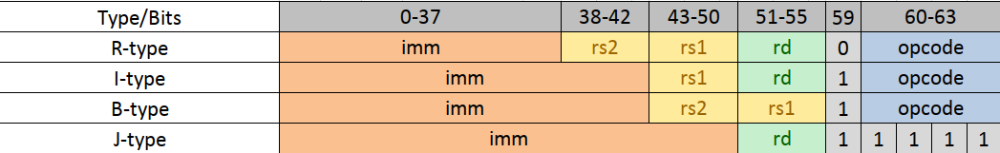
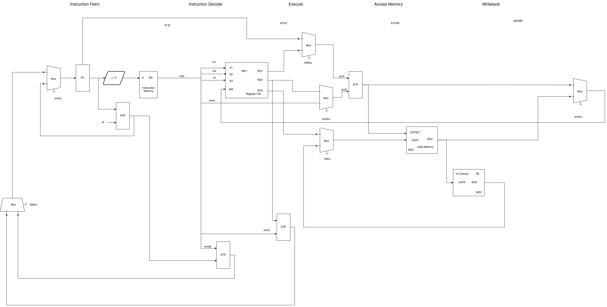
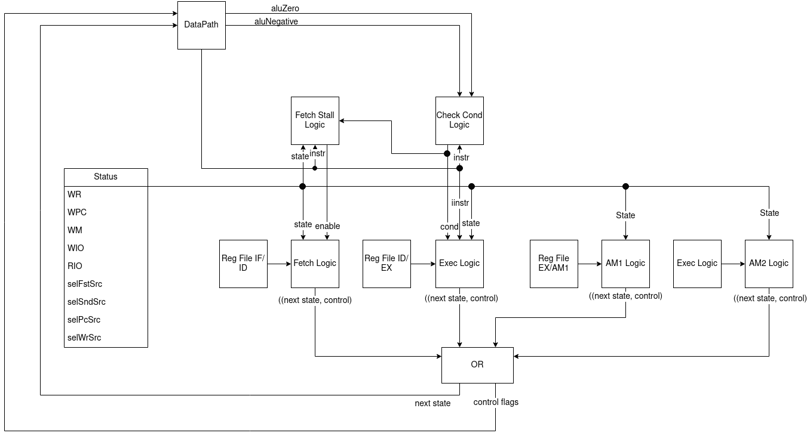

# Slang-Emulator
Выполнил: Баранов Вячеслав Григорьевич, 335185

Вариант: ```miranda | risc | harv | hw | instr | struct | stream | port | pstr | prob5 | pipeline```
## Язык программирования
```Slang``` &ndash; это упрощенный функциональный язык программирования, похожий на Miranda и имеющий небольшие синтаксические отличия.
Так как язык содержит немало конструкций, я решил привести его описание в виде БНФ с синтаксическим сахаром

```Haskell
Program ::= [FunctionDefinition]
FunctionDefinition ::= FunctionName "(" DefinitionArgs ")" "=" Expr
VariableDefinition ::= VariableName "=" Expr
DefinitionArgs ::= (Variable)
Expr ::= "(" Expr ")" | FunctionCall | LetExpr | IfThenElseExpr | BinOp Expr Expr | UnOp Expr | Primitive
FunctionCall ::= FunctionName CallArgs
LetExpr ::= "Let" [VariableDefinition] "In" VariableDefinition
IfThenElseExpr ::= "If" Expr "Then" Expr | "If" Expr "Then" Expr "Else" Expr
BinOp ::= + | - | * | / | == | > | < | /=
UnOp ::= - | head | tail
CallArgs ::= (Expr)
FunctionName ::= Name
VariableName ::= Name
Variable ::= Name
Name ::= UTF8-String
Primitive ::= Int | String | List | Bool
```
где
```Haskell
[T] - список элементов типа T, (T) - кортеж элементов типа T
```

Cтоит отметить, что язык не поддерживает pattern-matching, а работа со списками осуществляется с помощью функций из стандартной библиотеки языка. Такое решение было принято для того, чтобы не переусложнять логику компилятора.

## Организация памяти
Модель памяти процессора:
1. Память команд. Машинное слово &ndash; 64 бита. Линейное адресное пространство. Реализуется словарем высокоруровневых структур (см. [Instruction](src/ISA.hs#L103))
2. Память данных. Машинное слово &ndash; 64 бита. Линейное адресное пространсвто. Реализуется словарем
3. Порт ввода. Машинное слово &ndash; 64 бита. Линейное адресное пространство. Реализуется словарем
4. Порт вывода. Машинное слово &ndash; 64 бита. Линейное адресное пространство. Реализуется словарем

Я предпочел Data.Map обычным спискам Haskell ввиду удобства (и как не странно эффективности).

## Система команд (ISA)
Система команд содержит машинные слова фиксированного размера &ndash 64 бита. Существует 4 типа инструкций:


## Набор инструкций

| №  | Opcode | Инструкция | Тип машинного слова | Тип инструкции | Описание                             |
|----|--------|------------|---------------------|----------------|--------------------------------------|
| 1  | 0      | Add        | R                   | R-R            | ```rd <- @rs1 + @rs2```              |
| 2  | 1      | Sub        | R                   | R-R            | ```rd <- @rs1 - @rs2```              |
| 3  | 2      | Mul        | R                   | R-R            | ```rd <- @rs1 * @rs2```              |
| 4  | 3      | Div        | R                   | R-R            | ```rd <- @rs1 / @rs2```              |
| 5  | 8      | Mod        | R                   | R-R            | ```rd <- @rs1 % @rs2```              |
| 6  | 16     | AddI       | I                   | R-R            | ```rd <- @rs1 + imm```               |
| 7  | 17     | SubI       | I                   | R-R            | ```rd <- @rs1 - imm```               |
| 8  | 18     | MulI       | I                   | R-R            | ```rd <- @rs1 * imm```               |
| 9  | 19     | DivI       | I                   | R-R            | ```rd <- @rs1 / imm```               |
| 10 | 24     | ModI       | I                   | R-R            | ```rd <- @rs1 % imm```               |
| 11 | 20     | LWM        | I                   | R-M            | ```rd <- @data[@rs1+imm]```          |
| 12 | 21     | SWM        | I                   | R-M            | ```data[@rs1+imm] <- @rd```          |
| 13 | 22     | LWI        | I                   | M-M            | ```data[@rs1+imm] <- @in```          |
| 14 | 23     | SWO        | I                   | M-M            | ```@out <- data[@rs1+imm]```         |
| 15 | 4      | BE         | B                   | Branch         | ```if(@rs1==@rs2) pc <- pc + imm```  |
| 16 | 5      | BG         | B                   | Branch         | ```if(@rs1>@rs2) pc <- pc + imm```   |
| 17 | 6      | BNE        | B                   | Branch         | ```if(@rs1<>@rs2) pc <- pc + imm```  |
| 18 | 7      | BL         | B                   | Branch         | ```if(@rs1<@rs2) pc <- pc + imm ```  |
| 19 | 31     | JMP        | J                   | Jump           | ```pc <- @rd + imm```                |
| 20 | 25     | SavePC     | R                   | R-R            | ```ra <- pc```                       |

### Псевдоинстркуции
| №  | Инструкция  | Тип машинного слова | Тип инструкции | Описание                               |
|----|-------------|---------------------|----------------|--------------------------------        |
| 1  | BEL         | B                   | Branch         | if(@rs1==@rs2) pc <- @label            |
| 2  | BGL         | B                   | Branch         | if(@rs1>@rs2) pc <- @label             |
| 3  | BNEL        | B                   | Branch         | if(@rs1<>@rs2) pc <- @label            |
| 4  | BLL         | B                   | Branch         | if(@rs1<@rs2) pc <- @label             |
| 5  | JMPL        | J                   | Jump           | pc <- @label                           |
| 6  | PUSH        | -                   | -              | swm rs sp 0, subI sp sp 1              |
| 7  | POP         | -                   | -              | addI sp sp 1, lwm rd sp 0              |
| 8  | СALL        | -                   | -              | push ra, savePC, jump @label, pop ra   |

## Кодирование инструкций
Машинный код используется в виде высокоуровневой структуры данных (см. [Instruction](src/ISA.hs#L103))
## Модель процессора
### DataPath

### Control Unit

## Транслятор
[Исходный код](src/Translator.hs)

Преобразование происходит в четыре стадии:
```AST -> CFG -> Pseudo Asm -> Real Asm```

На второй стадии также происходит распределение регистров.

На четвертой стадии высчитываются реальные адреса меток и данных (см. [Converter](src/Converter.hs))
## Тестирование
В качестве тестов было использовано:
1. hello
2. cat
3. hello user
4. prob5

Тестирование проводилось при помощи golden tests и [unit tests для транслятора](test/unit/EmulatorTest.hs). Примеры тестов можно найти в папке golden

Для настройки CI я использовал github actions:
```jaml
jobs:
  lint:
    runs-on: ubuntu-latest
    container: haskell:9.4.8-buster
    steps:
      - name: Checkout
        uses: actions/checkout@v3
      - run: cabal update
      - uses: haskell-actions/hlint-setup@v2
        with:
          version: '3.1.6'
      - name: Lint
        uses: haskell-actions/hlint-run@v2
        with:
          path: '["src/", "test/"]'
          fail-on: error
  build-and-test:
    runs-on: ubuntu-latest
    container: haskell:9.4.8-buster
    steps:
      - name: Checkout
        uses: actions/checkout@v3
      - run: cabal update
      - name: Build
        run: cabal build Compiler-Release-exe Emulator-Release-exe Unit-tests-Release Golden-tests-Release
      - name: Unit-tests
        run: cabal run Unit-tests-Release
      - name: Golden-tests
        run: cabal run Golden-tests-Release
```
где:
1. ```hlint``` -- линтер для Haskell
2. Build -- сборка проекта при помощи ```cabal```
3. Test -- запуск тестов

Для удобства я также настроил пре-коммит хуки с использованием форматера, запуском линтера и тестов. Ознакомиться можно [тут](.pre-commit-config.yaml)

Журнал работы процессора на примере ```cat```:
```yaml
Source: |-
main() = output(input(5));
Instructions: |-
call main
halt
main:
addI t0 zero 5
add t1 a0 zero
swm t0 sp 0
subI sp sp 1
add a0 t0 zero
call input
addI sp sp 1
lwm t0 sp 0
add t1 a0 zero
swm t0 sp 0
subI sp sp 1
swm t1 sp 0
subI sp sp 1
add a0 t1 zero
call output
addI sp sp 1
lwm t1 sp 0
addI sp sp 1
lwm t0 sp 0
add a0 a0 zero
ret
input:
swm a0 dr 0
add a1 dr zero
_loop:
bel a0 zero _end
addI dr dr 1
lwi dr 0
subI a0 a0 1
jumpl _loop
_end:
add a0 a1 zero
addI dr dr 1
ret
output:
lwm t0 a0 0
_loop:
bel t0 zero _end
addI a0 a0 1
swo a0 0
subI t0 t0 1
jumpl _loop
_end:
addI dr dr 1
ret
addLists:
add t3 dr zero
lwm t0 a0 0
lwm t1 a1 0
add t2 t0 t1
swm t2 dr 0
_loop1:
bel t0 zero _loop2
addI dr dr 1
addI a0 a0 1
lwm tr a0 0
swm tr dr 0
subI t0 t0 1
jumpl _loop1
_loop2:
bel t1 zero _end
addI dr dr 1
addI a1 a1 1
lwm tr a1 0
swm tr dr 0
subI t1 t1 1
jumpl _loop2
_end:
add a0 t3 zero
addI dr dr 1
ret
head:
lwm a0 a0 1
ret
tail:
add t3 dr zero
lwm t0 a0 0
addI a0 a0 1
subI t0 t0 1
swm t0 dr 0
_loop:
bel t0 zero _end
addI a0 a0 1
addI dr dr 1
lwm tr a0 0
swm tr dr 0
subI t0 t0 4
jumpl _loop
_end:
add a0 t3 zero
addI dr dr 1
ret
outputChar:
swm a0 dr 0
swo dr 0
ret
outputInt:
bel a0 zero _output0
bll a0 zero _wsign
call outputPositiveInt
ret
_wsign:
swm s0 sp 0
subI sp sp 1
add s0 a0 zero
addI a0 zero 45
call outputChar
sub a0 zero s0
addI sp sp 1
lwm s0 sp 0
jumpl outputPositiveInt
_output0:
addI a0 zero 48
call outputChar
ret
outputPositiveInt:
bel a0 zero _end
swm a0 sp 0
subI sp sp 1
divI a0 a0 10
call outputPositiveInt
addI sp sp 1
lwm a0 sp 0
modI a0 a0 10
addI a0 a0 48
call outputChar
_end:
ret
id:
ret

Data Memory: |-
[]
Stdin: |-
HelloXasfdvasod;
Ticks: |-
pc: 0      | instruction: swm ra sp 0       | N: 0, Z: 1 | t0: 0 , t1: 0 , t2: 0 , t3: 0 , a0: 0 , a1: 0 , a2: 0 , s0: 0 , s1: 0 , s2: 0 , zero: 0, dr: 0 , ra: 0 , sp: 4096, tr: 0 | rin : 0, rout: 0
pc: 8      | instruction: subI sp sp 1      | N: 0, Z: 0 | t0: 0 , t1: 0 , t2: 0 , t3: 0 , a0: 0 , a1: 0 , a2: 0 , s0: 0 , s1: 0 , s2: 0 , zero: 0, dr: 0 , ra: 0 , sp: 4096, tr: 0 | rin : 0, rout: 0
pc: 16     | instruction: savePC            | N: 0, Z: 0 | t0: 0 , t1: 0 , t2: 0 , t3: 0 , a0: 0 , a1: 0 , a2: 0 , s0: 0 , s1: 0 , s2: 0 , zero: 0, dr: 0 , ra: 0 , sp: 4095, tr: 0 | rin : 0, rout: 0
pc: 24     | instruction: jump zero 56      | N: 0, Z: 0 | t0: 0 , t1: 0 , t2: 0 , t3: 0 , a0: 0 , a1: 0 , a2: 0 , s0: 0 , s1: 0 , s2: 0 , zero: 0, dr: 0 , ra: 16, sp: 4095, tr: 0 | rin : 0, rout: 0
pc: 56     | instruction: nop               | N: 0, Z: 1 | t0: 0 , t1: 0 , t2: 0 , t3: 0 , a0: 0 , a1: 0 , a2: 0 , s0: 0 , s1: 0 , s2: 0 , zero: 0, dr: 0 , ra: 16, sp: 4095, tr: 0 | rin : 0, rout: 0
pc: 64     | instruction: addI t0 zero 5    | N: 0, Z: 1 | t0: 0 , t1: 0 , t2: 0 , t3: 0 , a0: 0 , a1: 0 , a2: 0 , s0: 0 , s1: 0 , s2: 0 , zero: 0, dr: 0 , ra: 16, sp: 4095, tr: 0 | rin : 0, rout: 0
pc: 72     | instruction: add t1 a0 zero    | N: 0, Z: 0 | t0: 5 , t1: 0 , t2: 0 , t3: 0 , a0: 0 , a1: 0 , a2: 0 , s0: 0 , s1: 0 , s2: 0 , zero: 0, dr: 0 , ra: 16, sp: 4095, tr: 0 | rin : 0, rout: 0
pc: 80     | instruction: swm t0 sp 0       | N: 0, Z: 1 | t0: 5 , t1: 0 , t2: 0 , t3: 0 , a0: 0 , a1: 0 , a2: 0 , s0: 0 , s1: 0 , s2: 0 , zero: 0, dr: 0 , ra: 16, sp: 4095, tr: 0 | rin : 0, rout: 0
pc: 88     | instruction: subI sp sp 1      | N: 0, Z: 0 | t0: 5 , t1: 0 , t2: 0 , t3: 0 , a0: 0 , a1: 0 , a2: 0 , s0: 0 , s1: 0 , s2: 0 , zero: 0, dr: 0 , ra: 16, sp: 4095, tr: 0 | rin : 0, rout: 0
pc: 96     | instruction: add a0 t0 zero    | N: 0, Z: 0 | t0: 5 , t1: 0 , t2: 0 , t3: 0 , a0: 0 , a1: 0 , a2: 0 , s0: 0 , s1: 0 , s2: 0 , zero: 0, dr: 0 , ra: 16, sp: 4094, tr: 0 | rin : 0, rout: 0
pc: 104    | instruction: swm ra sp 0       | N: 0, Z: 0 | t0: 5 , t1: 0 , t2: 0 , t3: 0 , a0: 5 , a1: 0 , a2: 0 , s0: 0 , s1: 0 , s2: 0 , zero: 0, dr: 0 , ra: 16, sp: 4094, tr: 0 | rin : 0, rout: 0
pc: 112    | instruction: subI sp sp 1      | N: 0, Z: 0 | t0: 5 , t1: 0 , t2: 0 , t3: 0 , a0: 5 , a1: 0 , a2: 0 , s0: 0 , s1: 0 , s2: 0 , zero: 0, dr: 0 , ra: 16, sp: 4094, tr: 0 | rin : 0, rout: 0
pc: 120    | instruction: savePC            | N: 0, Z: 0 | t0: 5 , t1: 0 , t2: 0 , t3: 0 , a0: 5 , a1: 0 , a2: 0 , s0: 0 , s1: 0 , s2: 0 , zero: 0, dr: 0 , ra: 16, sp: 4093, tr: 0 | rin : 0, rout: 0
pc: 128    | instruction: jump zero 312     | N: 0, Z: 0 | t0: 5 , t1: 0 , t2: 0 , t3: 0 , a0: 5 , a1: 0 , a2: 0 , s0: 0 , s1: 0 , s2: 0 , zero: 0, dr: 0 , ra: 120, sp: 4093, tr: 0 | rin : 0, rout: 0
pc: 312    | instruction: nop               | N: 0, Z: 1 | t0: 5 , t1: 0 , t2: 0 , t3: 0 , a0: 5 , a1: 0 , a2: 0 , s0: 0 , s1: 0 , s2: 0 , zero: 0, dr: 0 , ra: 120, sp: 4093, tr: 0 | rin : 0, rout: 0
pc: 320    | instruction: swm a0 dr 0       | N: 0, Z: 1 | t0: 5 , t1: 0 , t2: 0 , t3: 0 , a0: 5 , a1: 0 , a2: 0 , s0: 0 , s1: 0 , s2: 0 , zero: 0, dr: 0 , ra: 120, sp: 4093, tr: 0 | rin : 0, rout: 0
pc: 328    | instruction: add a1 dr zero    | N: 0, Z: 1 | t0: 5 , t1: 0 , t2: 0 , t3: 0 , a0: 5 , a1: 0 , a2: 0 , s0: 0 , s1: 0 , s2: 0 , zero: 0, dr: 0 , ra: 120, sp: 4093, tr: 0 | rin : 0, rout: 0
pc: 336    | instruction: nop               | N: 0, Z: 1 | t0: 5 , t1: 0 , t2: 0 , t3: 0 , a0: 5 , a1: 0 , a2: 0 , s0: 0 , s1: 0 , s2: 0 , zero: 0, dr: 0 , ra: 120, sp: 4093, tr: 0 | rin : 0, rout: 0
pc: 344    | instruction: be a0 zero 32     | N: 0, Z: 1 | t0: 5 , t1: 0 , t2: 0 , t3: 0 , a0: 5 , a1: 0 , a2: 0 , s0: 0 , s1: 0 , s2: 0 , zero: 0, dr: 0 , ra: 120, sp: 4093, tr: 0 | rin : 0, rout: 0
pc: 352    | instruction: addI dr dr 1      | N: 0, Z: 0 | t0: 5 , t1: 0 , t2: 0 , t3: 0 , a0: 5 , a1: 0 , a2: 0 , s0: 0 , s1: 0 , s2: 0 , zero: 0, dr: 0 , ra: 120, sp: 4093, tr: 0 | rin : 0, rout: 0
pc: 360    | instruction: lwi dr 0          | N: 0, Z: 0 | t0: 5 , t1: 0 , t2: 0 , t3: 0 , a0: 5 , a1: 0 , a2: 0 , s0: 0 , s1: 0 , s2: 0 , zero: 0, dr: 1 , ra: 120, sp: 4093, tr: 0 | rin : 0, rout: 0
pc: 368    | instruction: subI a0 a0 1      | N: 0, Z: 0 | t0: 5 , t1: 0 , t2: 0 , t3: 0 , a0: 5 , a1: 0 , a2: 0 , s0: 0 , s1: 0 , s2: 0 , zero: 0, dr: 1 , ra: 120, sp: 4093, tr: 0 | rin : 8, rout: 0
pc: 376    | instruction: jump zero 336     | N: 0, Z: 0 | t0: 5 , t1: 0 , t2: 0 , t3: 0 , a0: 4 , a1: 0 , a2: 0 , s0: 0 , s1: 0 , s2: 0 , zero: 0, dr: 1 , ra: 120, sp: 4093, tr: 0 | rin : 8, rout: 0
pc: 336    | instruction: nop               | N: 0, Z: 0 | t0: 5 , t1: 0 , t2: 0 , t3: 0 , a0: 4 , a1: 0 , a2: 0 , s0: 0 , s1: 0 , s2: 0 , zero: 0, dr: 1 , ra: 120, sp: 4093, tr: 0 | rin : 8, rout: 0
pc: 344    | instruction: be a0 zero 32     | N: 0, Z: 0 | t0: 5 , t1: 0 , t2: 0 , t3: 0 , a0: 4 , a1: 0 , a2: 0 , s0: 0 , s1: 0 , s2: 0 , zero: 0, dr: 1 , ra: 120, sp: 4093, tr: 0 | rin : 8, rout: 0
pc: 352    | instruction: addI dr dr 1      | N: 0, Z: 0 | t0: 5 , t1: 0 , t2: 0 , t3: 0 , a0: 4 , a1: 0 , a2: 0 , s0: 0 , s1: 0 , s2: 0 , zero: 0, dr: 1 , ra: 120, sp: 4093, tr: 0 | rin : 8, rout: 0
pc: 360    | instruction: lwi dr 0          | N: 0, Z: 0 | t0: 5 , t1: 0 , t2: 0 , t3: 0 , a0: 4 , a1: 0 , a2: 0 , s0: 0 , s1: 0 , s2: 0 , zero: 0, dr: 2 , ra: 120, sp: 4093, tr: 0 | rin : 8, rout: 0
pc: 368    | instruction: subI a0 a0 1      | N: 0, Z: 0 | t0: 5 , t1: 0 , t2: 0 , t3: 0 , a0: 4 , a1: 0 , a2: 0 , s0: 0 , s1: 0 , s2: 0 , zero: 0, dr: 2 , ra: 120, sp: 4093, tr: 0 | rin : 16, rout: 0
pc: 376    | instruction: jump zero 336     | N: 0, Z: 0 | t0: 5 , t1: 0 , t2: 0 , t3: 0 , a0: 3 , a1: 0 , a2: 0 , s0: 0 , s1: 0 , s2: 0 , zero: 0, dr: 2 , ra: 120, sp: 4093, tr: 0 | rin : 16, rout: 0
pc: 336    | instruction: nop               | N: 0, Z: 0 | t0: 5 , t1: 0 , t2: 0 , t3: 0 , a0: 3 , a1: 0 , a2: 0 , s0: 0 , s1: 0 , s2: 0 , zero: 0, dr: 2 , ra: 120, sp: 4093, tr: 0 | rin : 16, rout: 0
pc: 344    | instruction: be a0 zero 32     | N: 0, Z: 0 | t0: 5 , t1: 0 , t2: 0 , t3: 0 , a0: 3 , a1: 0 , a2: 0 , s0: 0 , s1: 0 , s2: 0 , zero: 0, dr: 2 , ra: 120, sp: 4093, tr: 0 | rin : 16, rout: 0
pc: 352    | instruction: addI dr dr 1      | N: 0, Z: 0 | t0: 5 , t1: 0 , t2: 0 , t3: 0 , a0: 3 , a1: 0 , a2: 0 , s0: 0 , s1: 0 , s2: 0 , zero: 0, dr: 2 , ra: 120, sp: 4093, tr: 0 | rin : 16, rout: 0
pc: 360    | instruction: lwi dr 0          | N: 0, Z: 0 | t0: 5 , t1: 0 , t2: 0 , t3: 0 , a0: 3 , a1: 0 , a2: 0 , s0: 0 , s1: 0 , s2: 0 , zero: 0, dr: 3 , ra: 120, sp: 4093, tr: 0 | rin : 16, rout: 0
pc: 368    | instruction: subI a0 a0 1      | N: 0, Z: 0 | t0: 5 , t1: 0 , t2: 0 , t3: 0 , a0: 3 , a1: 0 , a2: 0 , s0: 0 , s1: 0 , s2: 0 , zero: 0, dr: 3 , ra: 120, sp: 4093, tr: 0 | rin : 24, rout: 0
pc: 376    | instruction: jump zero 336     | N: 0, Z: 0 | t0: 5 , t1: 0 , t2: 0 , t3: 0 , a0: 2 , a1: 0 , a2: 0 , s0: 0 , s1: 0 , s2: 0 , zero: 0, dr: 3 , ra: 120, sp: 4093, tr: 0 | rin : 24, rout: 0
pc: 336    | instruction: nop               | N: 0, Z: 0 | t0: 5 , t1: 0 , t2: 0 , t3: 0 , a0: 2 , a1: 0 , a2: 0 , s0: 0 , s1: 0 , s2: 0 , zero: 0, dr: 3 , ra: 120, sp: 4093, tr: 0 | rin : 24, rout: 0
pc: 344    | instruction: be a0 zero 32     | N: 0, Z: 0 | t0: 5 , t1: 0 , t2: 0 , t3: 0 , a0: 2 , a1: 0 , a2: 0 , s0: 0 , s1: 0 , s2: 0 , zero: 0, dr: 3 , ra: 120, sp: 4093, tr: 0 | rin : 24, rout: 0
pc: 352    | instruction: addI dr dr 1      | N: 0, Z: 0 | t0: 5 , t1: 0 , t2: 0 , t3: 0 , a0: 2 , a1: 0 , a2: 0 , s0: 0 , s1: 0 , s2: 0 , zero: 0, dr: 3 , ra: 120, sp: 4093, tr: 0 | rin : 24, rout: 0
pc: 360    | instruction: lwi dr 0          | N: 0, Z: 0 | t0: 5 , t1: 0 , t2: 0 , t3: 0 , a0: 2 , a1: 0 , a2: 0 , s0: 0 , s1: 0 , s2: 0 , zero: 0, dr: 4 , ra: 120, sp: 4093, tr: 0 | rin : 24, rout: 0
pc: 368    | instruction: subI a0 a0 1      | N: 0, Z: 0 | t0: 5 , t1: 0 , t2: 0 , t3: 0 , a0: 2 , a1: 0 , a2: 0 , s0: 0 , s1: 0 , s2: 0 , zero: 0, dr: 4 , ra: 120, sp: 4093, tr: 0 | rin : 32, rout: 0
pc: 376    | instruction: jump zero 336     | N: 0, Z: 0 | t0: 5 , t1: 0 , t2: 0 , t3: 0 , a0: 1 , a1: 0 , a2: 0 , s0: 0 , s1: 0 , s2: 0 , zero: 0, dr: 4 , ra: 120, sp: 4093, tr: 0 | rin : 32, rout: 0
pc: 336    | instruction: nop               | N: 0, Z: 0 | t0: 5 , t1: 0 , t2: 0 , t3: 0 , a0: 1 , a1: 0 , a2: 0 , s0: 0 , s1: 0 , s2: 0 , zero: 0, dr: 4 , ra: 120, sp: 4093, tr: 0 | rin : 32, rout: 0
pc: 344    | instruction: be a0 zero 32     | N: 0, Z: 0 | t0: 5 , t1: 0 , t2: 0 , t3: 0 , a0: 1 , a1: 0 , a2: 0 , s0: 0 , s1: 0 , s2: 0 , zero: 0, dr: 4 , ra: 120, sp: 4093, tr: 0 | rin : 32, rout: 0
pc: 352    | instruction: addI dr dr 1      | N: 0, Z: 0 | t0: 5 , t1: 0 , t2: 0 , t3: 0 , a0: 1 , a1: 0 , a2: 0 , s0: 0 , s1: 0 , s2: 0 , zero: 0, dr: 4 , ra: 120, sp: 4093, tr: 0 | rin : 32, rout: 0
pc: 360    | instruction: lwi dr 0          | N: 0, Z: 0 | t0: 5 , t1: 0 , t2: 0 , t3: 0 , a0: 1 , a1: 0 , a2: 0 , s0: 0 , s1: 0 , s2: 0 , zero: 0, dr: 5 , ra: 120, sp: 4093, tr: 0 | rin : 32, rout: 0
pc: 368    | instruction: subI a0 a0 1      | N: 0, Z: 0 | t0: 5 , t1: 0 , t2: 0 , t3: 0 , a0: 1 , a1: 0 , a2: 0 , s0: 0 , s1: 0 , s2: 0 , zero: 0, dr: 5 , ra: 120, sp: 4093, tr: 0 | rin : 40, rout: 0
pc: 376    | instruction: jump zero 336     | N: 0, Z: 1 | t0: 5 , t1: 0 , t2: 0 , t3: 0 , a0: 0 , a1: 0 , a2: 0 , s0: 0 , s1: 0 , s2: 0 , zero: 0, dr: 5 , ra: 120, sp: 4093, tr: 0 | rin : 40, rout: 0
pc: 336    | instruction: nop               | N: 0, Z: 1 | t0: 5 , t1: 0 , t2: 0 , t3: 0 , a0: 0 , a1: 0 , a2: 0 , s0: 0 , s1: 0 , s2: 0 , zero: 0, dr: 5 , ra: 120, sp: 4093, tr: 0 | rin : 40, rout: 0
pc: 344    | instruction: be a0 zero 32     | N: 0, Z: 1 | t0: 5 , t1: 0 , t2: 0 , t3: 0 , a0: 0 , a1: 0 , a2: 0 , s0: 0 , s1: 0 , s2: 0 , zero: 0, dr: 5 , ra: 120, sp: 4093, tr: 0 | rin : 40, rout: 0
pc: 384    | instruction: nop               | N: 0, Z: 1 | t0: 5 , t1: 0 , t2: 0 , t3: 0 , a0: 0 , a1: 0 , a2: 0 , s0: 0 , s1: 0 , s2: 0 , zero: 0, dr: 5 , ra: 120, sp: 4093, tr: 0 | rin : 40, rout: 0
pc: 392    | instruction: add a0 a1 zero    | N: 0, Z: 1 | t0: 5 , t1: 0 , t2: 0 , t3: 0 , a0: 0 , a1: 0 , a2: 0 , s0: 0 , s1: 0 , s2: 0 , zero: 0, dr: 5 , ra: 120, sp: 4093, tr: 0 | rin : 40, rout: 0
pc: 400    | instruction: addI dr dr 1      | N: 0, Z: 1 | t0: 5 , t1: 0 , t2: 0 , t3: 0 , a0: 0 , a1: 0 , a2: 0 , s0: 0 , s1: 0 , s2: 0 , zero: 0, dr: 5 , ra: 120, sp: 4093, tr: 0 | rin : 40, rout: 0
pc: 408    | instruction: ret               | N: 0, Z: 0 | t0: 5 , t1: 0 , t2: 0 , t3: 0 , a0: 0 , a1: 0 , a2: 0 , s0: 0 , s1: 0 , s2: 0 , zero: 0, dr: 6 , ra: 120, sp: 4093, tr: 0 | rin : 40, rout: 0
pc: 136    | instruction: addI sp sp 1      | N: 0, Z: 0 | t0: 5 , t1: 0 , t2: 0 , t3: 0 , a0: 0 , a1: 0 , a2: 0 , s0: 0 , s1: 0 , s2: 0 , zero: 0, dr: 6 , ra: 120, sp: 4093, tr: 0 | rin : 40, rout: 0
pc: 144    | instruction: lwm ra sp 0       | N: 0, Z: 0 | t0: 5 , t1: 0 , t2: 0 , t3: 0 , a0: 0 , a1: 0 , a2: 0 , s0: 0 , s1: 0 , s2: 0 , zero: 0, dr: 6 , ra: 120, sp: 4094, tr: 0 | rin : 40, rout: 0
pc: 152    | instruction: addI sp sp 1      | N: 0, Z: 0 | t0: 5 , t1: 0 , t2: 0 , t3: 0 , a0: 0 , a1: 0 , a2: 0 , s0: 0 , s1: 0 , s2: 0 , zero: 0, dr: 6 , ra: 16, sp: 4094, tr: 0 | rin : 40, rout: 0
pc: 160    | instruction: lwm t0 sp 0       | N: 0, Z: 0 | t0: 5 , t1: 0 , t2: 0 , t3: 0 , a0: 0 , a1: 0 , a2: 0 , s0: 0 , s1: 0 , s2: 0 , zero: 0, dr: 6 , ra: 16, sp: 4095, tr: 0 | rin : 40, rout: 0
pc: 168    | instruction: add t1 a0 zero    | N: 0, Z: 0 | t0: 5 , t1: 0 , t2: 0 , t3: 0 , a0: 0 , a1: 0 , a2: 0 , s0: 0 , s1: 0 , s2: 0 , zero: 0, dr: 6 , ra: 16, sp: 4095, tr: 0 | rin : 40, rout: 0
pc: 176    | instruction: swm t0 sp 0       | N: 0, Z: 1 | t0: 5 , t1: 0 , t2: 0 , t3: 0 , a0: 0 , a1: 0 , a2: 0 , s0: 0 , s1: 0 , s2: 0 , zero: 0, dr: 6 , ra: 16, sp: 4095, tr: 0 | rin : 40, rout: 0
pc: 184    | instruction: subI sp sp 1      | N: 0, Z: 0 | t0: 5 , t1: 0 , t2: 0 , t3: 0 , a0: 0 , a1: 0 , a2: 0 , s0: 0 , s1: 0 , s2: 0 , zero: 0, dr: 6 , ra: 16, sp: 4095, tr: 0 | rin : 40, rout: 0
pc: 192    | instruction: swm t1 sp 0       | N: 0, Z: 0 | t0: 5 , t1: 0 , t2: 0 , t3: 0 , a0: 0 , a1: 0 , a2: 0 , s0: 0 , s1: 0 , s2: 0 , zero: 0, dr: 6 , ra: 16, sp: 4094, tr: 0 | rin : 40, rout: 0
pc: 200    | instruction: subI sp sp 1      | N: 0, Z: 0 | t0: 5 , t1: 0 , t2: 0 , t3: 0 , a0: 0 , a1: 0 , a2: 0 , s0: 0 , s1: 0 , s2: 0 , zero: 0, dr: 6 , ra: 16, sp: 4094, tr: 0 | rin : 40, rout: 0
pc: 208    | instruction: add a0 t1 zero    | N: 0, Z: 0 | t0: 5 , t1: 0 , t2: 0 , t3: 0 , a0: 0 , a1: 0 , a2: 0 , s0: 0 , s1: 0 , s2: 0 , zero: 0, dr: 6 , ra: 16, sp: 4093, tr: 0 | rin : 40, rout: 0
pc: 216    | instruction: swm ra sp 0       | N: 0, Z: 1 | t0: 5 , t1: 0 , t2: 0 , t3: 0 , a0: 0 , a1: 0 , a2: 0 , s0: 0 , s1: 0 , s2: 0 , zero: 0, dr: 6 , ra: 16, sp: 4093, tr: 0 | rin : 40, rout: 0
pc: 224    | instruction: subI sp sp 1      | N: 0, Z: 0 | t0: 5 , t1: 0 , t2: 0 , t3: 0 , a0: 0 , a1: 0 , a2: 0 , s0: 0 , s1: 0 , s2: 0 , zero: 0, dr: 6 , ra: 16, sp: 4093, tr: 0 | rin : 40, rout: 0
pc: 232    | instruction: savePC            | N: 0, Z: 0 | t0: 5 , t1: 0 , t2: 0 , t3: 0 , a0: 0 , a1: 0 , a2: 0 , s0: 0 , s1: 0 , s2: 0 , zero: 0, dr: 6 , ra: 16, sp: 4092, tr: 0 | rin : 40, rout: 0
pc: 240    | instruction: jump zero 416     | N: 0, Z: 0 | t0: 5 , t1: 0 , t2: 0 , t3: 0 , a0: 0 , a1: 0 , a2: 0 , s0: 0 , s1: 0 , s2: 0 , zero: 0, dr: 6 , ra: 232, sp: 4092, tr: 0 | rin : 40, rout: 0
pc: 416    | instruction: nop               | N: 0, Z: 1 | t0: 5 , t1: 0 , t2: 0 , t3: 0 , a0: 0 , a1: 0 , a2: 0 , s0: 0 , s1: 0 , s2: 0 , zero: 0, dr: 6 , ra: 232, sp: 4092, tr: 0 | rin : 40, rout: 0
pc: 424    | instruction: lwm t0 a0 0       | N: 0, Z: 1 | t0: 5 , t1: 0 , t2: 0 , t3: 0 , a0: 0 , a1: 0 , a2: 0 , s0: 0 , s1: 0 , s2: 0 , zero: 0, dr: 6 , ra: 232, sp: 4092, tr: 0 | rin : 40, rout: 0
pc: 432    | instruction: nop               | N: 0, Z: 1 | t0: 5 , t1: 0 , t2: 0 , t3: 0 , a0: 0 , a1: 0 , a2: 0 , s0: 0 , s1: 0 , s2: 0 , zero: 0, dr: 6 , ra: 232, sp: 4092, tr: 0 | rin : 40, rout: 0
pc: 440    | instruction: be t0 zero 32     | N: 0, Z: 1 | t0: 5 , t1: 0 , t2: 0 , t3: 0 , a0: 0 , a1: 0 , a2: 0 , s0: 0 , s1: 0 , s2: 0 , zero: 0, dr: 6 , ra: 232, sp: 4092, tr: 0 | rin : 40, rout: 0
pc: 448    | instruction: addI a0 a0 1      | N: 0, Z: 0 | t0: 5 , t1: 0 , t2: 0 , t3: 0 , a0: 0 , a1: 0 , a2: 0 , s0: 0 , s1: 0 , s2: 0 , zero: 0, dr: 6 , ra: 232, sp: 4092, tr: 0 | rin : 40, rout: 0
pc: 456    | instruction: swo a0 0          | N: 0, Z: 0 | t0: 5 , t1: 0 , t2: 0 , t3: 0 , a0: 1 , a1: 0 , a2: 0 , s0: 0 , s1: 0 , s2: 0 , zero: 0, dr: 6 , ra: 232, sp: 4092, tr: 0 | rin : 40, rout: 0
pc: 464    | instruction: subI t0 t0 1      | N: 0, Z: 0 | t0: 5 , t1: 0 , t2: 0 , t3: 0 , a0: 1 , a1: 0 , a2: 0 , s0: 0 , s1: 0 , s2: 0 , zero: 0, dr: 6 , ra: 232, sp: 4092, tr: 0 | rin : 40, rout: 8
pc: 472    | instruction: jump zero 432     | N: 0, Z: 0 | t0: 4 , t1: 0 , t2: 0 , t3: 0 , a0: 1 , a1: 0 , a2: 0 , s0: 0 , s1: 0 , s2: 0 , zero: 0, dr: 6 , ra: 232, sp: 4092, tr: 0 | rin : 40, rout: 8
pc: 432    | instruction: nop               | N: 0, Z: 0 | t0: 4 , t1: 0 , t2: 0 , t3: 0 , a0: 1 , a1: 0 , a2: 0 , s0: 0 , s1: 0 , s2: 0 , zero: 0, dr: 6 , ra: 232, sp: 4092, tr: 0 | rin : 40, rout: 8
pc: 440    | instruction: be t0 zero 32     | N: 0, Z: 0 | t0: 4 , t1: 0 , t2: 0 , t3: 0 , a0: 1 , a1: 0 , a2: 0 , s0: 0 , s1: 0 , s2: 0 , zero: 0, dr: 6 , ra: 232, sp: 4092, tr: 0 | rin : 40, rout: 8
pc: 448    | instruction: addI a0 a0 1      | N: 0, Z: 0 | t0: 4 , t1: 0 , t2: 0 , t3: 0 , a0: 1 , a1: 0 , a2: 0 , s0: 0 , s1: 0 , s2: 0 , zero: 0, dr: 6 , ra: 232, sp: 4092, tr: 0 | rin : 40, rout: 8
pc: 456    | instruction: swo a0 0          | N: 0, Z: 0 | t0: 4 , t1: 0 , t2: 0 , t3: 0 , a0: 2 , a1: 0 , a2: 0 , s0: 0 , s1: 0 , s2: 0 , zero: 0, dr: 6 , ra: 232, sp: 4092, tr: 0 | rin : 40, rout: 8
pc: 464    | instruction: subI t0 t0 1      | N: 0, Z: 0 | t0: 4 , t1: 0 , t2: 0 , t3: 0 , a0: 2 , a1: 0 , a2: 0 , s0: 0 , s1: 0 , s2: 0 , zero: 0, dr: 6 , ra: 232, sp: 4092, tr: 0 | rin : 40, rout: 16
pc: 472    | instruction: jump zero 432     | N: 0, Z: 0 | t0: 3 , t1: 0 , t2: 0 , t3: 0 , a0: 2 , a1: 0 , a2: 0 , s0: 0 , s1: 0 , s2: 0 , zero: 0, dr: 6 , ra: 232, sp: 4092, tr: 0 | rin : 40, rout: 16
pc: 432    | instruction: nop               | N: 0, Z: 0 | t0: 3 , t1: 0 , t2: 0 , t3: 0 , a0: 2 , a1: 0 , a2: 0 , s0: 0 , s1: 0 , s2: 0 , zero: 0, dr: 6 , ra: 232, sp: 4092, tr: 0 | rin : 40, rout: 16
pc: 440    | instruction: be t0 zero 32     | N: 0, Z: 0 | t0: 3 , t1: 0 , t2: 0 , t3: 0 , a0: 2 , a1: 0 , a2: 0 , s0: 0 , s1: 0 , s2: 0 , zero: 0, dr: 6 , ra: 232, sp: 4092, tr: 0 | rin : 40, rout: 16
pc: 448    | instruction: addI a0 a0 1      | N: 0, Z: 0 | t0: 3 , t1: 0 , t2: 0 , t3: 0 , a0: 2 , a1: 0 , a2: 0 , s0: 0 , s1: 0 , s2: 0 , zero: 0, dr: 6 , ra: 232, sp: 4092, tr: 0 | rin : 40, rout: 16
pc: 456    | instruction: swo a0 0          | N: 0, Z: 0 | t0: 3 , t1: 0 , t2: 0 , t3: 0 , a0: 3 , a1: 0 , a2: 0 , s0: 0 , s1: 0 , s2: 0 , zero: 0, dr: 6 , ra: 232, sp: 4092, tr: 0 | rin : 40, rout: 16
pc: 464    | instruction: subI t0 t0 1      | N: 0, Z: 0 | t0: 3 , t1: 0 , t2: 0 , t3: 0 , a0: 3 , a1: 0 , a2: 0 , s0: 0 , s1: 0 , s2: 0 , zero: 0, dr: 6 , ra: 232, sp: 4092, tr: 0 | rin : 40, rout: 24
pc: 472    | instruction: jump zero 432     | N: 0, Z: 0 | t0: 2 , t1: 0 , t2: 0 , t3: 0 , a0: 3 , a1: 0 , a2: 0 , s0: 0 , s1: 0 , s2: 0 , zero: 0, dr: 6 , ra: 232, sp: 4092, tr: 0 | rin : 40, rout: 24
pc: 432    | instruction: nop               | N: 0, Z: 0 | t0: 2 , t1: 0 , t2: 0 , t3: 0 , a0: 3 , a1: 0 , a2: 0 , s0: 0 , s1: 0 , s2: 0 , zero: 0, dr: 6 , ra: 232, sp: 4092, tr: 0 | rin : 40, rout: 24
pc: 440    | instruction: be t0 zero 32     | N: 0, Z: 0 | t0: 2 , t1: 0 , t2: 0 , t3: 0 , a0: 3 , a1: 0 , a2: 0 , s0: 0 , s1: 0 , s2: 0 , zero: 0, dr: 6 , ra: 232, sp: 4092, tr: 0 | rin : 40, rout: 24
pc: 448    | instruction: addI a0 a0 1      | N: 0, Z: 0 | t0: 2 , t1: 0 , t2: 0 , t3: 0 , a0: 3 , a1: 0 , a2: 0 , s0: 0 , s1: 0 , s2: 0 , zero: 0, dr: 6 , ra: 232, sp: 4092, tr: 0 | rin : 40, rout: 24
pc: 456    | instruction: swo a0 0          | N: 0, Z: 0 | t0: 2 , t1: 0 , t2: 0 , t3: 0 , a0: 4 , a1: 0 , a2: 0 , s0: 0 , s1: 0 , s2: 0 , zero: 0, dr: 6 , ra: 232, sp: 4092, tr: 0 | rin : 40, rout: 24
pc: 464    | instruction: subI t0 t0 1      | N: 0, Z: 0 | t0: 2 , t1: 0 , t2: 0 , t3: 0 , a0: 4 , a1: 0 , a2: 0 , s0: 0 , s1: 0 , s2: 0 , zero: 0, dr: 6 , ra: 232, sp: 4092, tr: 0 | rin : 40, rout: 32
pc: 472    | instruction: jump zero 432     | N: 0, Z: 0 | t0: 1 , t1: 0 , t2: 0 , t3: 0 , a0: 4 , a1: 0 , a2: 0 , s0: 0 , s1: 0 , s2: 0 , zero: 0, dr: 6 , ra: 232, sp: 4092, tr: 0 | rin : 40, rout: 32
pc: 432    | instruction: nop               | N: 0, Z: 0 | t0: 1 , t1: 0 , t2: 0 , t3: 0 , a0: 4 , a1: 0 , a2: 0 , s0: 0 , s1: 0 , s2: 0 , zero: 0, dr: 6 , ra: 232, sp: 4092, tr: 0 | rin : 40, rout: 32
pc: 440    | instruction: be t0 zero 32     | N: 0, Z: 0 | t0: 1 , t1: 0 , t2: 0 , t3: 0 , a0: 4 , a1: 0 , a2: 0 , s0: 0 , s1: 0 , s2: 0 , zero: 0, dr: 6 , ra: 232, sp: 4092, tr: 0 | rin : 40, rout: 32
pc: 448    | instruction: addI a0 a0 1      | N: 0, Z: 0 | t0: 1 , t1: 0 , t2: 0 , t3: 0 , a0: 4 , a1: 0 , a2: 0 , s0: 0 , s1: 0 , s2: 0 , zero: 0, dr: 6 , ra: 232, sp: 4092, tr: 0 | rin : 40, rout: 32
pc: 456    | instruction: swo a0 0          | N: 0, Z: 0 | t0: 1 , t1: 0 , t2: 0 , t3: 0 , a0: 5 , a1: 0 , a2: 0 , s0: 0 , s1: 0 , s2: 0 , zero: 0, dr: 6 , ra: 232, sp: 4092, tr: 0 | rin : 40, rout: 32
pc: 464    | instruction: subI t0 t0 1      | N: 0, Z: 0 | t0: 1 , t1: 0 , t2: 0 , t3: 0 , a0: 5 , a1: 0 , a2: 0 , s0: 0 , s1: 0 , s2: 0 , zero: 0, dr: 6 , ra: 232, sp: 4092, tr: 0 | rin : 40, rout: 40
pc: 472    | instruction: jump zero 432     | N: 0, Z: 1 | t0: 0 , t1: 0 , t2: 0 , t3: 0 , a0: 5 , a1: 0 , a2: 0 , s0: 0 , s1: 0 , s2: 0 , zero: 0, dr: 6 , ra: 232, sp: 4092, tr: 0 | rin : 40, rout: 40
pc: 432    | instruction: nop               | N: 0, Z: 1 | t0: 0 , t1: 0 , t2: 0 , t3: 0 , a0: 5 , a1: 0 , a2: 0 , s0: 0 , s1: 0 , s2: 0 , zero: 0, dr: 6 , ra: 232, sp: 4092, tr: 0 | rin : 40, rout: 40

Exit code: |-
Halt: Stopping execution
Stdout: |-
Hello
Total: |-
115 instructions executed
```
Пример проверки исходного кода:
```bash
$ cabal run Golden-tests
Slang golden tests
  hello: OK
  fact:  OK
  cat:   OK
  prob5: OK (0.04s)

All 4 tests passed (0.04s)
```
```bash
$ cabal run Unit-tests
Cases: 9  Tried: 1  Errors: 0  Failures: 0
Cases: 9  Tried: 2  Errors: 0  Failures: 0
Cases: 9  Tried: 3  Errors: 0  Failures: 0
Cases: 9  Tried: 4  Errors: 0  Failures: 0
Cases: 9  Tried: 5  Errors: 0  Failures: 0
Cases: 9  Tried: 6  Errors: 0  Failures: 0
Cases: 9  Tried: 7  Errors: 0  Failures: 0
Cases: 9  Tried: 8  Errors: 0  Failures: 0
Cases: 9  Tried: 9  Errors: 0  Failures: 0
```

## Алгоритмы

| ФИО                          | Алг   | LoC | code байт | code инстр. | инстр. | такт. | вариант                                                                               |
|------------------------------|-------|-----|-----------|-------------|--------|-------|---------------------------------------------------------------------------------------|
| Баранов Вячеслав Григорьевич | hello      | 1   | 944       | 118         | 108    | 108   | miranda , risc , harv , hw , instr , struct , stream , port , pstr , prob5 , pipeline |
| Баранов Вячеслав Григорьевич | cat        | 1   | 516       | 129         | 115    | 115   | miranda , risc , harv , hw , instr , struct , stream , port , pstr , prob5 , pipeline |
| Баранов Вячеслав Григорьевич | hello user | 1   | 1592      | 199         | 464   | 464    | miranda , risc , harv , hw , instr , struct , stream , port , pstr , prob5 , pipeline |
| Баранов Вячеслав Григорьевич | prob5      | 4   | 2856      | 357         | 7693   | 7693  | miranda , risc , harv , hw , instr , struct , stream , port , pstr , prob5 , pipeline |
