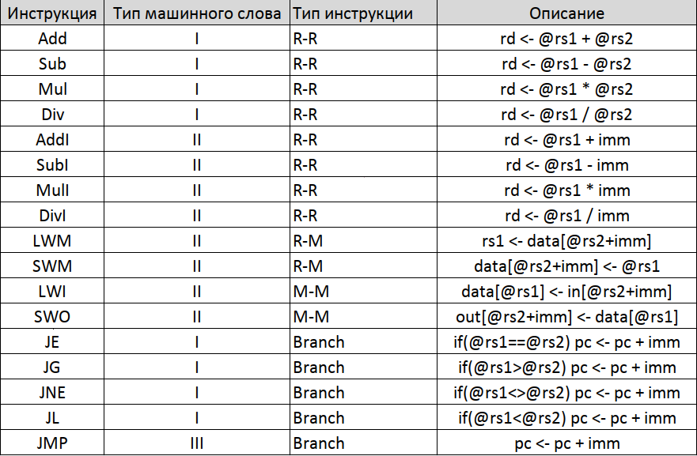

# Slang-Emulator
Выполнил: Баранов Вячеслав Григорьевич, 335185

Вариант: miranda | risc | harv | hw | instr | struct | stream | port | pstr | prob5
## Язык программирования
TBD
## Организация памяти
Модель памяти процессора:
1. Память команд. Машинное слово -- 32 бита. Линейное адресное пространство. Реализуется списком высокоуровневых* структур.
2. Память данных. Машинное слово -- 32 бита. Линейное адресное пространсвто. Реализуется списком чисел
3. Порт ввода. Машинное слово -- 32 бита. В него умещаются 4 utf-8 символа. Реализуется списком чисел
4. Порт вывода. Машинное слово -- 32 бита. В него умещаются 4 utf-8 символа. Реализуется списком чисел

Описание механизма работы с переменными, константами и литералами: TBD*
## Система команд (ISA)
Процессор содержит машинные слова фиксированного размера -- 32 бита. Существует 3 типа инструкций:

1. I-type для инструкций типа rd = f(rs1, rs2) и условных переходов (см. набор инструкций)
2. II-type для инструкций типа rd = f(rs1, const)
3. III-type для безусловного перехода

## Набор инструкций


Также для удобства существует набор псевдоинструкци, которые обрабатываются препроцессором и заменяются на реальные инструкции.

Псевдоинструкции для потока управления```jel, jgl, jnel, jll, jmpl``` используют метки, заменяются на соответствующие инструкции с использованием реальных адресов.

Псевдоинструкции для работы со стеком ```push rd = Add pc pc 1; SWM rd pc zero```  и ```pop rd = Sub pc pc 1; LWM rd pc zero```
## Кодирование инструкций
Машинный код не сериализуется, а преобрауется в структуру данных (см. TBD) 
## Транслятор
TBD* Можно написать транслятор для ассемблера
## Модель процессора
### DataPath 
### Control Unit
## Тестирование
В качестве тестов было использовано:
1. hello world
2. cat
3. prob5
Тестирование проводилось при помощи golden tests. Примеры тестов можно найти в папке golden

Для настройки CI я использовал github actions:
```jaml
jobs:
  build-and-test:
    runs-on: ubuntu-latest
    container: haskell:9.4.8-buster
    steps:
      - name: Checkout
        uses: actions/checkout@v3
      - run: cabal update
      - uses: haskell-actions/hlint-setup@v2
        with:
          version: '3.1.6'
      - name: Lint
        uses: haskell-actions/hlint-run@v2
        with:
          path: '["src/", "test/"]'
          fail-on: warning
      - name: Build
        run: cabal build
      - name: Test
        run: cabal run Emulator-test
```
где:
1. ```hlint``` -- линтер для Haskell
1. Build -- сборка проекта при помощи ```cabal```
1. Test -- запуск тестов

Для удобства я также настроил пре-коммит хуки с использованием форматера, запуском линтера и тестов. Ознакомитьс можно [тут](https://github.com/algoritmist/Slang-Emulator/blob/main/.pre-commit-config.yaml)
Журнал работы процессора на примере ```cat```:

TBD
Пример проверки исходного кода:

TBD
## Алгоритмы
TBD