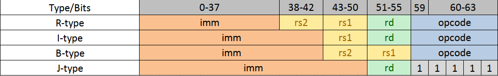
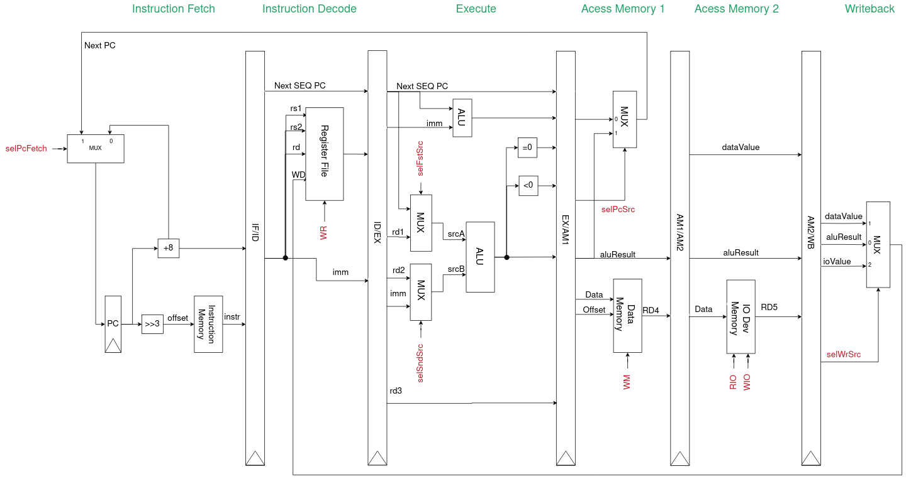

# Slang-Emulator
Выполнил: Баранов Вячеслав Григорьевич, 335185

Вариант: miranda | risc | harv | hw | instr | struct | stream | port | pstr | prob5 | pipeline
## Язык программирования
```Slang``` &ndash; это упрощенный функциональный язык программирования, похожий на Miranda и имеющий небольшие синтаксические отличия.
Так как язык содержит немало конструкций, я решил привести его описание в виде БНФ с синтаксическим сахаром

```Haskell
Program ::= [FunctionDefinition]
FunctionDefinition ::= FunctionName "(" DefinitionArgs ")" "=" Expr
VariableDefinition ::= VariableName "=" Expr
DefinitionArgs ::= (Variable)
Expr ::= "(" Expr ")" | FunctionCall | LetExpr | IfThenElseExpr | BinOp Expr Expr | UnOp Expr | Primitive
FunctionCall ::= FunctionName CallArgs
LetExpr ::= "let" [VariableDefinition] "in" VariableDefinition
IfThenElseExpr ::= "if" Expr "then" [Expr] | "if" Expr "then" [Expr] "else" [Expr]
BinOp ::= + | - | * | / | == | > | < | /= | ++
UnOp ::= - | not | head | tail
CallArgs ::= (Expr)
FunctionName ::= Name
VariableName ::= Name
Variable ::= Name
Name ::= UTF8-String
Primitive ::= Int | String | List | Bool
```
где
```Haskell
[T] - список элементов типа T, (T) - кортеж элементов типа T
```

Cтоит отметить, что язык не поддерживает pattern-matching, а работа со списками осуществляется с помощью функций из стандартной библиотеки языка. Такое решение было принято для того, чтобы не переусложнять логику компилятора.

## Организация памяти
Модель памяти процессора:
1. Память команд. Машинное слово &ndash; 64 бита. Линейное адресное пространство. Реализуется как Map* Int Instruction**
2. Память данных. Машинное слово &ndash; 64 бита. Линейное адресное пространсвто. Реализуется как Map Int Int
3. Порт ввода. Машинное слово &ndash; 64 бита. В него умещаются 4 ascii символа. Линейное адресное пространство. Реализуется как Map Int Int
4. Порт вывода. Машинное слово &ndash; 64 бита. В него умещаются 4 ascii символа. Линейное адресное пространство. Реализуется как Map Int Int

*Я предпочел Data.Map обычным спискам Haskell ввиду удобства (и как не странно эффективности).

**Instruction &ndash; высокоуровневая структура, см. 

## Система команд (ISA)
Система команд содержит машинные слова фиксированного размера &ndash 64 бита. Существует 3 типа инструкций:

1. I-type для инструкций типа rd = f(rs1, rs2) и условных переходов (см. набор инструкций)
2. II-type для инструкций типа rd = f(rs1, const)
3. III-type для безусловного перехода

## Набор инструкций


Также для удобства существует набор псевдоинструкций, таких как ```push rd``` и ```pop rd```, которые обрабатываются препроцессором и заменяются на реальные инструкции.
## Кодирование инструкций
Машинный код не сериализуется, а преобрауется в структуру данных (см. TBD)
## Транслятор
TBD* Можно написать транслятор для ассемблера
## Модель процессора
### DataPath

### Control Unit

## Тестирование
В качестве тестов было использовано:
1. hello world
2. cat
3. prob5

Тестирование проводилось при помощи golden tests. Примеры тестов можно найти в папке golden

Для настройки CI я использовал github actions:
```jaml
jobs:
  lint:
    runs-on: ubuntu-latest
    container: haskell:9.4.8-buster
    steps:
      - name: Checkout
        uses: actions/checkout@v3
      - run: cabal update
      - uses: haskell-actions/hlint-setup@v2
        with:
          version: '3.1.6'
      - name: Lint
        uses: haskell-actions/hlint-run@v2
        with:
          path: '["src/", "test/"]'
          fail-on: error
  build-and-test:
    runs-on: ubuntu-latest
    container: haskell:9.4.8-buster
    steps:
      - name: Checkout
        uses: actions/checkout@v3
      - run: cabal update
      - name: Build
        run: cabal build Compiler-Release-exe Emulator-Release-exe Unit-tests-Release Golden-tests-Release
      - name: Unit-tests
        run: cabal run Unit-tests-Release
      - name: Golden-tests
        run: cabal run Golden-tests-Release
```
где:
1. ```hlint``` -- линтер для Haskell
2. Build -- сборка проекта при помощи ```cabal```
3. Test -- запуск тестов

Для удобства я также настроил пре-коммит хуки с использованием форматера, запуском линтера и тестов. Ознакомитьс можно [тут](.pre-commit-config.yaml)

Журнал работы процессора на примере ```cat```:
```
Ticks: |-
pc: 0     , instruction: swm ra sp 0      , t0: 0 , t1: 0 , t2: 0 , t3: 0 , a0: 0 , a1: 0 , a2: 0 , s0: 0 , s1: 0 , s2: 0 , zero: 0, dr: 0 , ra: 0 , sp: 4096, tr: 0, rin : 0, rout: 0
pc: 8     , instruction: subI sp sp 1     , t0: 0 , t1: 0 , t2: 0 , t3: 0 , a0: 0 , a1: 0 , a2: 0 , s0: 0 , s1: 0 , s2: 0 , zero: 0, dr: 0 , ra: 0 , sp: 4096, tr: 0, rin : 0, rout: 0
pc: 16    , instruction: savePC           , t0: 0 , t1: 0 , t2: 0 , t3: 0 , a0: 0 , a1: 0 , a2: 0 , s0: 0 , s1: 0 , s2: 0 , zero: 0, dr: 0 , ra: 0 , sp: 4095, tr: 0, rin : 0, rout: 0
pc: 24    , instruction: jump zero 56     , t0: 0 , t1: 0 , t2: 0 , t3: 0 , a0: 0 , a1: 0 , a2: 0 , s0: 0 , s1: 0 , s2: 0 , zero: 0, dr: 0 , ra: 16, sp: 4095, tr: 0, rin : 0, rout: 0
pc: 56    , instruction: nop              , t0: 0 , t1: 0 , t2: 0 , t3: 0 , a0: 0 , a1: 0 , a2: 0 , s0: 0 , s1: 0 , s2: 0 , zero: 0, dr: 0 , ra: 16, sp: 4095, tr: 0, rin : 0, rout: 0
pc: 64    , instruction: addI t0 zero 0   , t0: 0 , t1: 0 , t2: 0 , t3: 0 , a0: 0 , a1: 0 , a2: 0 , s0: 0 , s1: 0 , s2: 0 , zero: 0, dr: 0 , ra: 16, sp: 4095, tr: 0, rin : 0, rout: 0
pc: 72    , instruction: add t1 a0 zero   , t0: 0 , t1: 0 , t2: 0 , t3: 0 , a0: 0 , a1: 0 , a2: 0 , s0: 0 , s1: 0 , s2: 0 , zero: 0, dr: 0 , ra: 16, sp: 4095, tr: 0, rin : 0, rout: 0
pc: 80    , instruction: swm t0 sp 0      , t0: 0 , t1: 0 , t2: 0 , t3: 0 , a0: 0 , a1: 0 , a2: 0 , s0: 0 , s1: 0 , s2: 0 , zero: 0, dr: 0 , ra: 16, sp: 4095, tr: 0, rin : 0, rout: 0
pc: 88    , instruction: subI sp sp 1     , t0: 0 , t1: 0 , t2: 0 , t3: 0 , a0: 0 , a1: 0 , a2: 0 , s0: 0 , s1: 0 , s2: 0 , zero: 0, dr: 0 , ra: 16, sp: 4095, tr: 0, rin : 0, rout: 0
pc: 96    , instruction: add a0 t0 zero   , t0: 0 , t1: 0 , t2: 0 , t3: 0 , a0: 0 , a1: 0 , a2: 0 , s0: 0 , s1: 0 , s2: 0 , zero: 0, dr: 0 , ra: 16, sp: 4094, tr: 0, rin : 0, rout: 0
pc: 104   , instruction: swm ra sp 0      , t0: 0 , t1: 0 , t2: 0 , t3: 0 , a0: 0 , a1: 0 , a2: 0 , s0: 0 , s1: 0 , s2: 0 , zero: 0, dr: 0 , ra: 16, sp: 4094, tr: 0, rin : 0, rout: 0
pc: 112   , instruction: subI sp sp 1     , t0: 0 , t1: 0 , t2: 0 , t3: 0 , a0: 0 , a1: 0 , a2: 0 , s0: 0 , s1: 0 , s2: 0 , zero: 0, dr: 0 , ra: 16, sp: 4094, tr: 0, rin : 0, rout: 0
pc: 120   , instruction: savePC           , t0: 0 , t1: 0 , t2: 0 , t3: 0 , a0: 0 , a1: 0 , a2: 0 , s0: 0 , s1: 0 , s2: 0 , zero: 0, dr: 0 , ra: 16, sp: 4093, tr: 0, rin : 0, rout: 0
pc: 128   , instruction: jump zero 288    , t0: 0 , t1: 0 , t2: 0 , t3: 0 , a0: 0 , a1: 0 , a2: 0 , s0: 0 , s1: 0 , s2: 0 , zero: 0, dr: 0 , ra: 120, sp: 4093, tr: 0, rin : 0, rout: 0
pc: 288   , instruction: nop              , t0: 0 , t1: 0 , t2: 0 , t3: 0 , a0: 0 , a1: 0 , a2: 0 , s0: 0 , s1: 0 , s2: 0 , zero: 0, dr: 0 , ra: 120, sp: 4093, tr: 0, rin : 0, rout: 0
pc: 296   , instruction: lwm t0 a0 0      , t0: 0 , t1: 0 , t2: 0 , t3: 0 , a0: 0 , a1: 0 , a2: 0 , s0: 0 , s1: 0 , s2: 0 , zero: 0, dr: 0 , ra: 120, sp: 4093, tr: 0, rin : 0, rout: 0
pc: 304   , instruction: nop              , t0: 1 , t1: 0 , t2: 0 , t3: 0 , a0: 0 , a1: 0 , a2: 0 , s0: 0 , s1: 0 , s2: 0 , zero: 0, dr: 0 , ra: 120, sp: 4093, tr: 0, rin : 0, rout: 0
pc: 312   , instruction: je t0 zero 32    , t0: 1 , t1: 0 , t2: 0 , t3: 0 , a0: 0 , a1: 0 , a2: 0 , s0: 0 , s1: 0 , s2: 0 , zero: 0, dr: 0 , ra: 120, sp: 4093, tr: 0, rin : 0, rout: 0
pc: 320   , instruction: addI a0 a0 1     , t0: 1 , t1: 0 , t2: 0 , t3: 0 , a0: 0 , a1: 0 , a2: 0 , s0: 0 , s1: 0 , s2: 0 , zero: 0, dr: 0 , ra: 120, sp: 4093, tr: 0, rin : 0, rout: 0
pc: 328   , instruction: swo a0 0         , t0: 1 , t1: 0 , t2: 0 , t3: 0 , a0: 1 , a1: 0 , a2: 0 , s0: 0 , s1: 0 , s2: 0 , zero: 0, dr: 0 , ra: 120, sp: 4093, tr: 0, rin : 0, rout: 0
pc: 336   , instruction: subI t0 t0 1     , t0: 1 , t1: 0 , t2: 0 , t3: 0 , a0: 1 , a1: 0 , a2: 0 , s0: 0 , s1: 0 , s2: 0 , zero: 0, dr: 0 , ra: 120, sp: 4093, tr: 0, rin : 0, rout: 8
pc: 344   , instruction: jump zero 304    , t0: 0 , t1: 0 , t2: 0 , t3: 0 , a0: 1 , a1: 0 , a2: 0 , s0: 0 , s1: 0 , s2: 0 , zero: 0, dr: 0 , ra: 120, sp: 4093, tr: 0, rin : 0, rout: 8
pc: 304   , instruction: nop              , t0: 0 , t1: 0 , t2: 0 , t3: 0 , a0: 1 , a1: 0 , a2: 0 , s0: 0 , s1: 0 , s2: 0 , zero: 0, dr: 0 , ra: 120, sp: 4093, tr: 0, rin : 0, rout: 8
pc: 312   , instruction: je t0 zero 32    , t0: 0 , t1: 0 , t2: 0 , t3: 0 , a0: 1 , a1: 0 , a2: 0 , s0: 0 , s1: 0 , s2: 0 , zero: 0, dr: 0 , ra: 120, sp: 4093, tr: 0, rin : 0, rout: 8
pc: 352   , instruction: nop              , t0: 0 , t1: 0 , t2: 0 , t3: 0 , a0: 1 , a1: 0 , a2: 0 , s0: 0 , s1: 0 , s2: 0 , zero: 0, dr: 0 , ra: 120, sp: 4093, tr: 0, rin : 0, rout: 8
pc: 360   , instruction: addI dr dr 1     , t0: 0 , t1: 0 , t2: 0 , t3: 0 , a0: 1 , a1: 0 , a2: 0 , s0: 0 , s1: 0 , s2: 0 , zero: 0, dr: 0 , ra: 120, sp: 4093, tr: 0, rin : 0, rout: 8
pc: 368   , instruction: ret              , t0: 0 , t1: 0 , t2: 0 , t3: 0 , a0: 1 , a1: 0 , a2: 0 , s0: 0 , s1: 0 , s2: 0 , zero: 0, dr: 1 , ra: 120, sp: 4093, tr: 0, rin : 0, rout: 8
pc: 136   , instruction: addI sp sp 1     , t0: 0 , t1: 0 , t2: 0 , t3: 0 , a0: 1 , a1: 0 , a2: 0 , s0: 0 , s1: 0 , s2: 0 , zero: 0, dr: 1 , ra: 120, sp: 4093, tr: 0, rin : 0, rout: 8
pc: 144   , instruction: lwm ra sp 0      , t0: 0 , t1: 0 , t2: 0 , t3: 0 , a0: 1 , a1: 0 , a2: 0 , s0: 0 , s1: 0 , s2: 0 , zero: 0, dr: 1 , ra: 120, sp: 4094, tr: 0, rin : 0, rout: 8
pc: 152   , instruction: addI sp sp 1     , t0: 0 , t1: 0 , t2: 0 , t3: 0 , a0: 1 , a1: 0 , a2: 0 , s0: 0 , s1: 0 , s2: 0 , zero: 0, dr: 1 , ra: 16, sp: 4094, tr: 0, rin : 0, rout: 8
pc: 160   , instruction: lwm t0 sp 0      , t0: 0 , t1: 0 , t2: 0 , t3: 0 , a0: 1 , a1: 0 , a2: 0 , s0: 0 , s1: 0 , s2: 0 , zero: 0, dr: 1 , ra: 16, sp: 4095, tr: 0, rin : 0, rout: 8
pc: 168   , instruction: add a0 a0 zero   , t0: 0 , t1: 0 , t2: 0 , t3: 0 , a0: 1 , a1: 0 , a2: 0 , s0: 0 , s1: 0 , s2: 0 , zero: 0, dr: 1 , ra: 16, sp: 4095, tr: 0, rin : 0, rout: 8
pc: 176   , instruction: ret              , t0: 0 , t1: 0 , t2: 0 , t3: 0 , a0: 1 , a1: 0 , a2: 0 , s0: 0 , s1: 0 , s2: 0 , zero: 0, dr: 1 , ra: 16, sp: 4095, tr: 0, rin : 0, rout: 8
pc: 32    , instruction: addI sp sp 1     , t0: 0 , t1: 0 , t2: 0 , t3: 0 , a0: 1 , a1: 0 , a2: 0 , s0: 0 , s1: 0 , s2: 0 , zero: 0, dr: 1 , ra: 16, sp: 4095, tr: 0, rin : 0, rout: 8
pc: 40    , instruction: lwm ra sp 0      , t0: 0 , t1: 0 , t2: 0 , t3: 0 , a0: 1 , a1: 0 , a2: 0 , s0: 0 , s1: 0 , s2: 0 , zero: 0, dr: 1 , ra: 16, sp: 4096, tr: 0, rin : 0, rout: 8
pc: 48    , instruction: halt             , t0: 0 , t1: 0 , t2: 0 , t3: 0 , a0: 1 , a1: 0 , a2: 0 , s0: 0 , s1: 0 , s2: 0 , zero: 0, dr: 1 , ra: 0 , sp: 4096, tr: 0, rin : 0, rout: 8

Exit code: |-
Halt: Stopping execution
Stdout: |-
H
Total: |-
36 instructions executed
```
Пример проверки исходного кода:
```bash
$ cabal run Golden-tests
Slang golden tests
  hello: OK
  fact:  OK
  cat:   OK
  prob5: OK (0.04s)

All 4 tests passed (0.04s)
```
## Алгоритмы
| ФИО                          | Алг   | LoC  | code байт | code инстр. | инстр. | такт.                                                                                 | вариант |
| ---------------------------- | ----- | ---- | --------- | ----------- | ------ | ------------------------------------------------------------------------------------- |
| Баранов Вячеслав Григорьевич | hello | 944  | 118       | 108         | 108    | miranda , risc , harv , hw , instr , struct , stream , port , pstr , prob5 , pipeline |
| Баранов Вячеслав Григорьевич | cat   | 516  | 129       | 115         | 115    | miranda , risc , harv , hw , instr , struct , stream , port , pstr , prob5 , pipeline |
| Баранов Вячеслав Григорьевич | prob5 | 2856 | 357       | 7693        | 7693   | miranda , risc , harv , hw , instr , struct , stream , port , pstr , prob5 , pipeline |